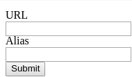
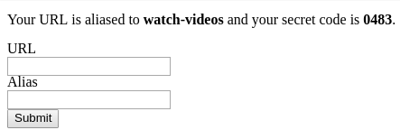
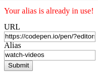

# Orientation Example Exam

We are going to create something like a [URL shortening](https://en.wikipedia.org/wiki/URL_shortening)
application but we are not going to struggle with random strings rather we will
create a *"URL aliasing application"*.

**Read the whole description in order to understand the application.**

## `GET /`
- The main page should be rendered
- It should contain a form with two labels, two input fields and a submit button
- The form should be submitted to `POST /save-link`

### The main page has 3 scenarios

#### Default


#### Success
- It should show the message "Your URL is aliased to {alias} and your
  secret code is {secret code}."
- It should clear the input fields



#### Error
- It should show the default view
- It should show the message "Your alias is already in use!"
- It should **not** clear the input fields



## `POST /save-link`
- If the alias is already in use redirect to the main page with the error scenario
- Else
  - Generate a secret code which is just a random 4-digit integer
  - Store the entry in the database
  - Redirect to the main page with the success scenario

## `GET /a/{alias}`
- If the alias exists it should increment the hit count and redirect to the URL
  otherwise respond with 404 status code

## `GET /api/links`
- It should respond with the stored entries in the following JSON format
- Note that the secret code is not included
  ```json
  [
    {
      "id": 0,
      "url": "http://reddit.com",
      "alias": "bye-bye-time",
      "hitCount": 0
    },
    {
      "id": 1,
      "url": "http://youtube.com",
      "alias": "watch-videos",
      "hitCount": 4
    }
  ]
  ```

## `DELETE /api/links/{id}`
- The secret code should be in the request's body in JSON format
  ```json
  {
    "secretCode": 0483
  }
  ```
- If it doesn't exists respond with 404 status code
- If it exists but the provided secret code doesn't match respond with 403
  status code
- If it exists and the provided secret code matches delete the entry from the
  database and respond with 204 status code
